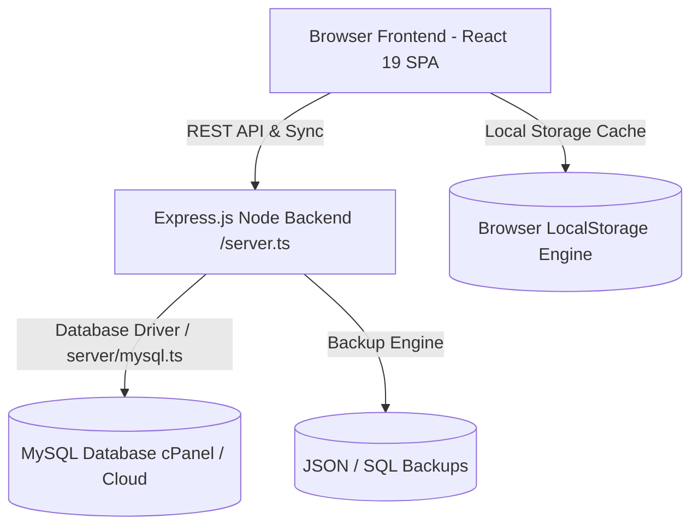

# Mouj Climbing Club Management System
### سامانه جامع مدیریت باشگاه ورزشی و سنگ‌نوردی موج

[](https://react.dev/)
[](https://www.typescriptlang.org/)
[](https://tailwindcss.com/)
[](https://expressjs.com/)
[](https://www.mysql.com/)

An enterprise-grade full-stack Web Application specifically engineered for indoor sports facility automation, athlete pre-registration, multi-role membership management, attendance tracking, financial accounting, sports insurance validation, support ticket management, and parent portal consolidation.

---

## 📚 Complete Project Documentation Suite

The project includes an enterprise-level documentation suite housed in the [`/docs`](docs/00-README.md) directory:

👉 **[Click here to open the Master Documentation Index (docs/00-README.md)](docs/00-README.md)**

### Key Documentation Highlights

- **[01-Project-Overview.md](docs/01-Project-Overview.md):** Business goals, system capabilities, and stakeholder scope
- **[03-System-Architecture.md](docs/03-System-Architecture.md):** Dual storage engine topology and offline-first sync architecture
- **[06-Development-Setup.md](docs/06-Development-Setup.md):** Local environment installation & step-by-step setup guide
- **[08-Database.md](docs/08-Database.md):** Complete relational MySQL database schema, columns, datatypes, and ERD
- **[10-Authorization.md](docs/10-Authorization.md):** Multi-role RBAC access matrix and permission definitions
- **[14-API.md](docs/14-API.md):** Complete REST API specifications and payload schemas
- **[23-Deployment.md](docs/23-Deployment.md):** Step-by-step cPanel shared hosting deployment guide

---

## ⚡ Quick Start Guide

### Prerequisites
- **Node.js:** `>= 20.0.0`
- **npm:** `>= 10.0.0`
- **MySQL / MariaDB:** `8.0+` (Optional for local offline testing)

### Installation & Run

1. **Clone & Install Dependencies:**
   ```bash
   git clone https://github.com/your-org/mouj-climbing-club.git
   cd mouj-climbing-club
   npm install
   ```

2. **Configure Environment:**
   ```bash
   cp .env.example .env
   ```

3. **Start Development Server:**
   ```bash
   npm run dev
   ```
   Open `http://localhost:3000` in your web browser.

4. **Build for Production:**
   ```bash
   npm run build
   npm run start
   ```

---

## 🗺 System Architecture Overview



---

## 📜 License & Governance
All documentation files are maintained under Markdown compliance standards. Historical project documentation artifacts are preserved in [`/docs/archive/`](docs/archive/).
