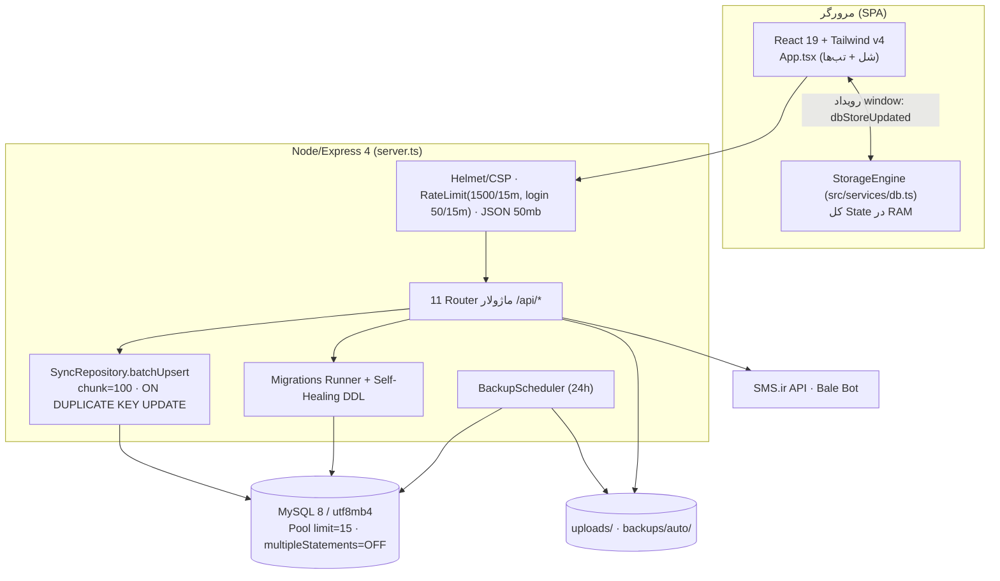

# ۰۲ — معماری سیستم

## ۱. نمای کلان



## ۲. الگوی معماری داده: Full-State Sync

این پروژه از الگوی رایج REST-per-entity **فاصله دارد**؛ مدل غالب این است:

1. کلاینت **کل دیتابیس را یکجا** load می‌کند (`GET /api/mysql/full-data`) و در آرایه‌های حافظه نگه می‌دارد.
2. هر تغییر ابتدا به‌صورت خوشبینانه در حافظه اعمال می‌شود.
3. سپس دو مسیر موازی ارسال می‌شود:
   - `sendMutation` → اندپوینت REST اختصاصی (برای جریان‌های حساس: تراکنش مالی، ثبت‌نام، حضور، کاربران)
   - `saveAll()` → `POST /api/mysql/sync` با **کل State** در یک بدنه JSON (debounce 100ms)
4. پولینگ ۵ ثانیه‌ای (وقتی tab فعال است) + focus + visibilitychange ⇒ reload کامل.
5. سرور sync را در **یک تراکنش اتمیک** (withTransaction) با upsert چانکی اجرا می‌کند؛ خطا ⇒ rollback کامل.

### مزایا
- سادگی شدید CRUD؛ آفلاین‌فرندلی؛ همگرایی سریع چند تب.
- یکنواختی کد: همه Entityها یک مسیر ذخیره دارند.

### هزینه‌های ساختاری
- هر mutation = ارسال مگابایت‌ها JSON (کاربران+مالی+...) روی `/api/mysql/sync`.
- سطح دسترسی این اندپوینت فقط `authenticateJwt` است → ریسک امنیتی جدی (بخش ۶-ممیزی).
- Conflict resolution بر اساس مقایسه رشته‌ای تاریخ جلالی `updatedAt` در SQL (`LENGTH()` heuristic) — شکننده.
- بدون pagination واقعی؛ مقیاس‌پذیری محدود به حجم کل DB.

## ۳. جریان بوت‌استرپ سرور

```
startServer()
 ├─ configureSecurityMiddlewares (helmet + 2×rate-limiter)
 ├─ express.json({limit:'50mb'}) · /uploads static
 ├─ mount 12 router (/api/*) + 404 JSON + errorHandler
 ├─ readyPromise: ensureAllTablesExist (DDL + ensureCol self-healing)
 │                 → runMigrations (schema_migrations)
 │                 → startBackupScheduler()
 ├─ GET /api/health (SELECT 1)
 ├─ dev: vite middleware | prod: express.static(dist)+SPA fallback
 ├─ listen :3000 (0.0.0.0)
 └─ SIGTERM/SIGINT → closeMySqlPool() → server.close() (+exit سقوط آزاد 5s)
```

نکته: `uncaughtException`/`unhandledRejection` **log و ادامه حیات** می‌دهند (انتخاب عمدی برای جلوگیری از مرگ dev-server) — در production رفتار بحث‌برانگیزی است.

## ۴. RBAC و گاردها

| Guard | ترکیب | استفاده اصلی |
|---|---|---|
| staffGuard | JWT + [super_admin, admin, secretary, coach, accountant] | لیست کاربران، آپلود |
| adminGuard | JWT + [super_admin, admin, secretary] | backup، bulk-images |
| financeGuard | مشابه staff | finance |
| superAdminGuard | JWT + [super_admin] | sync-detailed، hash-all-passwords |
| checkInstallAccess | اگر نصب نشده=عمومی، وگرنه super_admin | install |

⚠️ `requireRoles` برای هر نقشی که `admin` یا `super_admin` در roles داشته باشد bypass می‌شود؛ و `activeRole` هم مجاز شمرده می‌شود — یعنی «سوییچ نقش» عملاً قدرت full-admin دارد اگر roles کاربر شامل آن‌ها باشد.

## ۵. دیباگ/دیاگنوستیک داخلی

- `POST /api/mysql/sync-detailed`: sync جدول‌به‌جدول با لاگ فارسی برای `SyncDiagnosticsModal` (admin).
- `MySqlTablesTestModal`: تست ساختار جداول از UI.
- `GET /api/install/status`: وضعیت نصب/اتصال + نمایش host/database/user.
