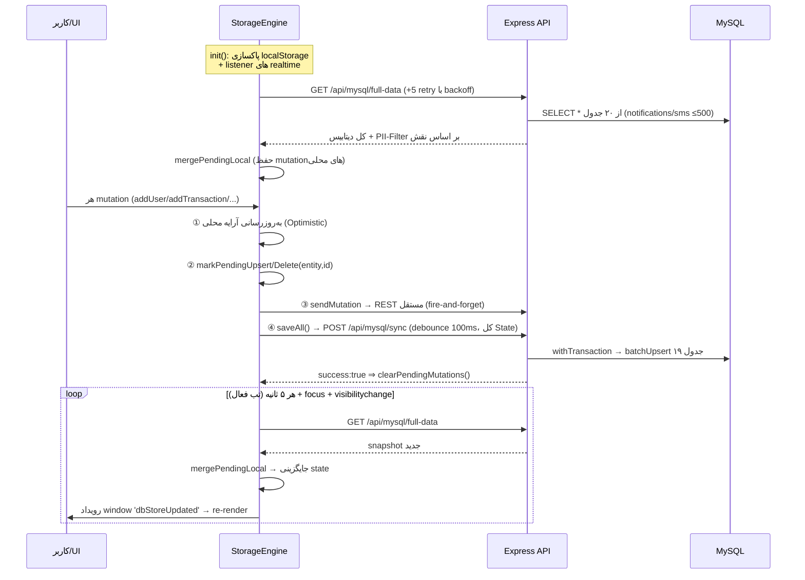

# ۰۳ — گردش دیتا (Data Flow)

## ۱. چرخه حیات داده در کلاینت (StorageEngine)



### سازوکارهای حفاظتی دقیق:

| سازوکار | مکان | عملکرد |
|---|---|---|
| **pendingLocalMutations** | `db.ts:289` | Map با کلید `entity\|id`؛ در loadFromBackendMySql ادغام می‌شود تا پولینگ ۵ثانیه‌ای تغییرات خوشبینانه را overwrite نکند. فقط پس از COMMIT موفق سرور پاک می‌شود |
| **offlineQueue** | `db.ts:373` | اگر REST خطای 5xx/401/403 یا قطعی شبکه داد ⇒ صف می‌شود؛ `flushOfflineQueue` به‌ترتیب replay می‌کند (سقف ۵۰۰ آیتم). 401/403 هم قابل retry تلقی می‌شوند تا بعد از ورود مجدد اعمال شوند |
| **Double-click Guard** | `db.ts:332` | پنجره ۱۵۰۰ms برای addTransaction و createShopInvoice |
| **Idempotency-Key** | finance.routes | کلید = id تراکنش؛ UNIQUE index + مدیریت ER_DUP_ENTRY ⇒ پاسخ duplicate:true |
| **Soft-Void مالی** | deleteTransaction | به‌جای DELETE فیزیکی: `status='cancelled'` + voidedAt/By/Reason |
| **Version Sync** | updateUser | پس از PUT موفق، version از پاسخ سرور؛ 409 ⇒ reload کامل |

## ۲. سطح‌بندی PII در full-data (سمت سرور)

`GET /api/mysql/full-data` با `optionalJwt` کار می‌کند و سه سطح خروجی دارد:

| سطح | شرط | داده تحویلی |
|---|---|---|
| Privileged | roles ∈ {super_admin, admin, secretary, accountant, coach} | کامل (بدون password) |
| کاربر عادی | JWT معتبر athlete | users بدون فیلدهای SENSITIVE (nationalId, phone, address, medicalConditions,...)؛ فقط تراکنش‌ها/بیمه/فاکتور/بدهیِ خودش؛ creditors=[] |
| ناشناس | بدون توکن | users بدون SENSITIVE، preRegistrations بدون SENSITIVE، تراکنش/بیمه/فاکتور/بدهی = خالی |

⚠️ حتی در سطح ناشناس، **لیست اسامی/نقش‌ها/آواتار همه اعضا** تحویل داده می‌شود (یافته H4 در ممیزی).

## ۳. گردش احراز هویت

```
Login form → POST /api/auth/login {username(nationalId یا username), password}
 ← 200 {token(JWT 30d), user(بدون password, شامل mustChangePassword)}
 → توکن در sessionStorage['club_app_token'] ذخیره می‌شود (نه cookie؛ نه rememberMe واقعی)
 → همه درخواست‌ها: Authorization: Bearer
 → 401 در sync ⇒ رویداد dbStoreAuthExpired (بدون logout اجباری)
Change-password → flag mustChangePassword=0 (اجبار UI اولین ورود: پیاده نشده)
Logout → پاکسازی sessionStorage + localStorage.clear() در mount
```

## ۴. گردش فایل و تصویر

- آپلود multipart: `POST /api/upload` (optionalJwt!) → multer → **magic-byte check** → نگهداری در `uploads/` → URL برگشتی.
- مسیر sync: فرانت گاهی base64 در JSON می‌فرستد؛ `convertBase64ToLocalFile` روی سرور base64 را به فایل تبدیل و ستون را با `/uploads/...` جایگزین می‌کند (سقف 5MB + whitelist magic bytes + sanitize نام).
- تصاویر بزرگ سمت کلاینت با `imageCompressor` فشرده می‌شوند.

## ۵. گردش بکاپ و بازیابی

```
BackupScheduler (بوت+60s، سپس هر BACKUP_INTERVAL_HOURS=24h)
 → SELECT * از ۱۹ جدول → backups/auto/moj_auto_daily_<stamp>.json
 → (اختیاری) کپی به BACKUP_REMOTE_DIR
 → applyRetention: نگهداری ۷ روز کامل + ۱ بکاپ/هفته تا ۴ هفته + ۱ بکاپ/ماه تا ۳ ماه
Restore (adminGuard): POST /api/backup/restore {filename|backupData}
 → path.basename (ضد traversal) → withTransaction → batchUpsert (merge نه replace!)
 ⚠️ restore «ادغامی» است؛ رکوردهای حذف‌شده بعد از بکاپ بازمی‌گردند
```

## ۶. جریان پیامک/Bale

`POST /api/sms/*` (staffGuard) → کلید API از body یا کش `club_settings` یا env → پروکسی به api.sms.ir → نتیجه در جدول sms_logs ثبت و از طریق sync به همه کلاینت‌ها برمی‌گردد.
