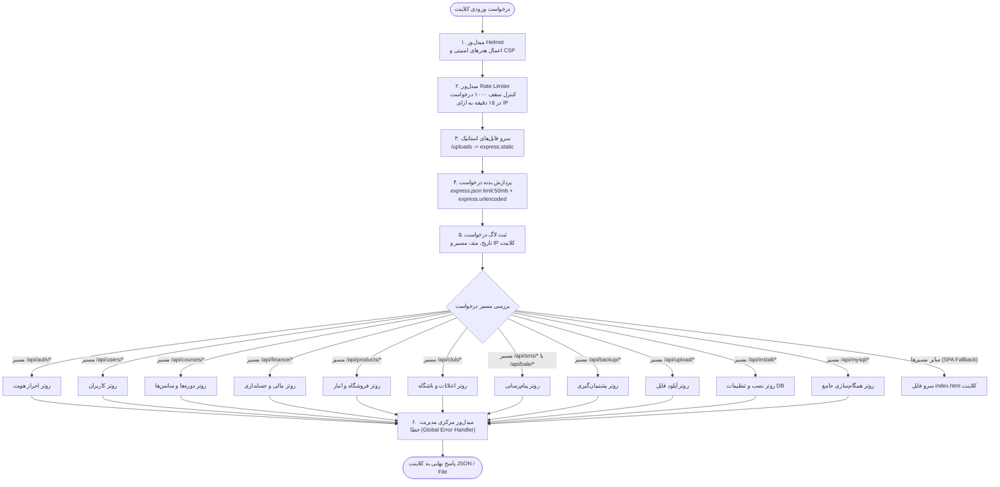
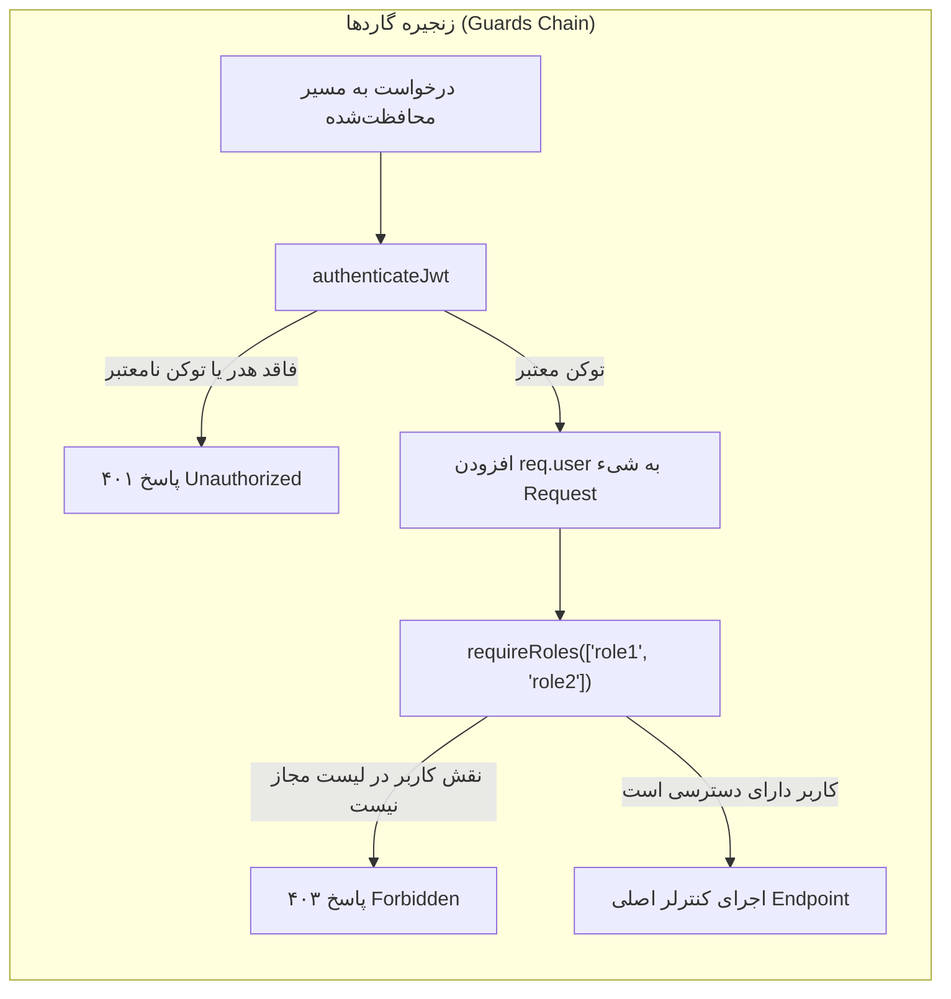
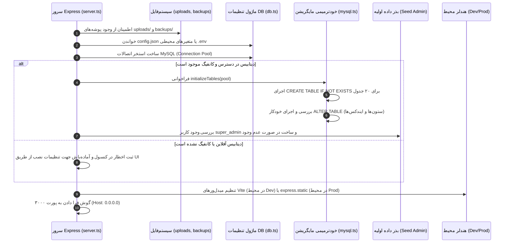

# ⚙️ جریان پردازش و پایپ‌لاین بک‌اند (Backend Flow)

## ۱. پایپ‌لاین پردازش درخواست در Express

نقطه ورود سرور در فایل `/server.ts` تعریف شده است. درخواست‌های ورودی یک خط لوله (Pipeline) ترتیبی از میدل‌ورها را طی می‌کنند:



---

## ۲. زنجیره میدل‌ورهای امنیتی و احراز هویت

کنترل دسترسی‌ها بر پایه JWT و کنترل دسترسی مبتنی بر نقش (RBAC) انجام می‌شود:



---

## ۳. چرخه حیات راه‌اندازی سرور (Server Bootstrap Lifecycle)

هنگام استارت سرور با دستور `node dist/server.cjs` یا `tsx server.ts`، مراحل زیر اجرا می‌گردد:



---

## ۴. استراتژی مدیریت خطای سرور

تمام خطاها در کنترلرها از طریق بلوک‌های `try/catch` مهار شده و به میدل‌ور متمرکز مدیریت خطا ارسال می‌شوند. فرمت استاندارد پاسخ خطا در سرور:

```json
{
  "success": false,
  "error": "پیام خطای فارسی و قابل فهم برای کاربر",
  "details": "اطلاعات تکمیلی در حالت غیرتولیدی (اختیاری)"
}
```
کدهای وضعیت استاندارد مورد استفاده:
- `200 OK`: انجام موفق عملیات
- `201 Created`: ثبت موفقیت‌آمیز منبع جدید (کاربر، محصول، تراکنش، ...)
- `400 Bad Request`: نقص در پارامترهای اجباری یا اعتبارسنجی ورودی
- `401 Unauthorized`: عدم ارائه توکن معتبر
- `403 Forbidden`: عدم کفایت سطح دسترسی یا تلاش برای دسترسی به رکورد غیرمجاز (IDOR)
- `404 Not Found`: عدم یافتن رکورد مورد تقاضا
- `500 Internal Server Error`: خطای سیستمی دیتابیس یا سرور
