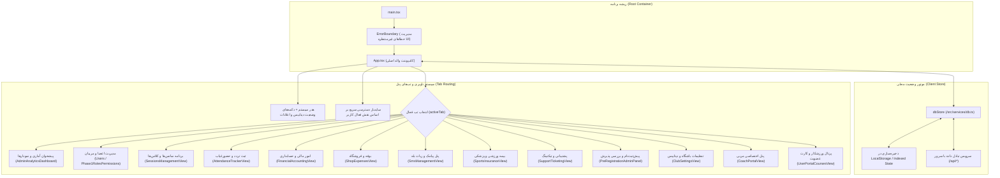

# 💻 معماری فرانت‌اند و مدیریت وضعیت (Frontend Flow)

## ۱. نمای کلی فرانت‌اند

فرانت‌اند سامانه بر پایه **React 19** و ابزار ساخت سریع **Vite 6** با زبان **TypeScript** طراحی شده و استایل‌دهی آن با استفاده از امکانات نسخه جدید **Tailwind CSS 4** صورت گرفته است.

---

## ۲. ساختار مدیریت وضعیت (`dbStore`)

فرانت‌اند از یک سرویس مدیریت داده واکنش‌گرا (`dbStore`) استفاده می‌کند که رویدادها را در حافظه مدیریت کرده و لیسنرهای متصل به UI را مطلع می‌سازد:

1. **متدهای خواندن داده (Getters):**
   - `getUsers()`, `getUserById(id)`, `getCurrentUser()`
   - `getSessions()`, `getUserEnrollments(userId)`
   - `getTransactions()`, `getShopProducts()`, `getShopInvoices()`
   - `getAttendanceRecords()`, `getClubSettings()`

2. **متدهای تغییر داده (Mutations):**
   - `saveUser(user)`, `deleteUser(id)`
   - `saveSession(session)`, `saveEnrollment(enrollment)`
   - `saveTransaction(tx)`, `saveProduct(prod)`
   - `markNotificationRead(id)`

3. **الگوی همگام‌سازی (Optimistic UI Update with Server Sync):**
   - به هنگام ایجاد یا تغییر رکورد، داده بلافاصله در حافظه محلی کلاینت به‌روزرسانی شده و رابط کاربری بدون تاخیر پاسخ می‌دهد.
   - همزمان، یک درخواست HTTP غیرهمگام به سرور ارسال می‌شود تا رکورد در دیتابیس MySQL پایدار گردد.

---

## ۳. سلسله‌مراتب مودال‌های تعاملی (Modals)

سامانه از مودال‌های تخصصی بدون تغییر صفحه برای تعاملات عمیق استفاده می‌کند:
- `DigitalMembershipCardModal`: صدور و نمایش کارت عضویت دیجیتال مجهز به بارکد Code128، کد QR و چرخش سه‌بعدی کارت.
- `Member360Modal`: نمایش جامع مشخصات ورزشکار، پرونده پزشکی، سوابق ثبت‌نام، کارت‌های عضویت، تیکت‌ها و تراکنش‌های مالی.
- `EditEnrollmentModal`: ویرایش مهلت اعتبار ثبت‌نام، تعداد جلسات مجاز و تسویه بدهی دوره.
- `ProductDetailModal` و `ShopInvoiceDetailModal`: مشاهده و صدور فاکتور رسمی فروشگاه.
- `SyncDiagnosticsModal`: دیاگ مرحله‌به‌مرحله و آنالیز خط‌به‌خط جداول دیتابیس.
- `MySqlTablesTestModal`: مانیتورینگ سلامت ۲۰ جدول دیتابیس و شمارش زنده رکوردها.
