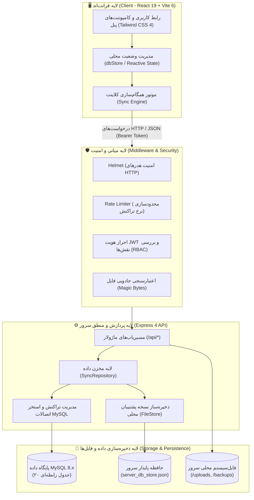
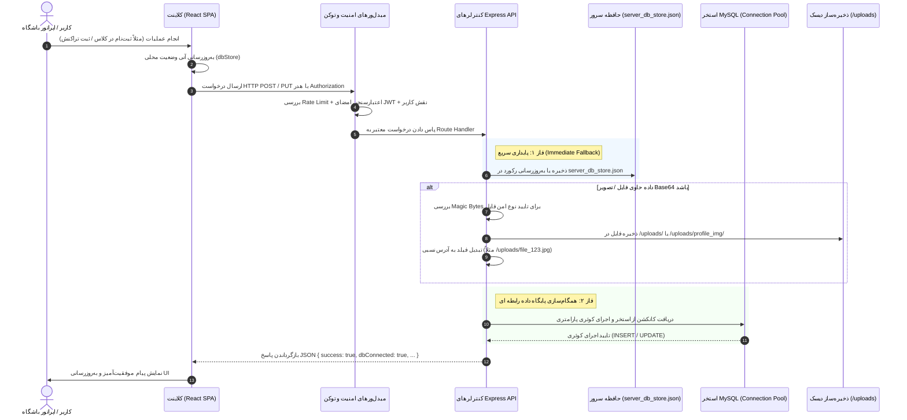

# 🏗️ معماری کلان سیستم (System Overview)

## ۱. نمای کلی و معماری سه‌لایه (Three-Tier Architecture)

سامانه باشگاه سنگ‌نوردی موج ۶۹ بر پایه یک معماری ماژولار و یکپارچه Full-Stack توسعه یافته است. در این مدل، کلاینت به عنوان یک Single Page Application (SPA) در React 19 اجرا شده و با بک‌اند مبتنی بر Express 4 و پایگاه داده MySQL در تعامل دائم است.

---

## ۲. جریان گردش داده‌ها در کل سامانه (End-to-End Data Flow)

سامانه از یک الگوی **«ذخیره‌سازی پیشگیرانه دوگانه» (Dual-Storage Durability Pattern)** پیروی می‌کند:

---

## ۳. اجزای اصلی معماری و وظایف آن‌ها

### ۳.۱. لایه کلاینت (Frontend)
- **کامپوننت‌های ماژولار:** تفکیک کامل بخش‌های عملیاتی به کامپوننت‌های تخصصی مانند `DigitalMembershipCardModal`, `AttendanceTrackerView`, `FinancialAccountingView` و `PreRegistrationAdminPanel`.
- **موتور محلی `dbStore`:** نگه‌داری وضعیت فعال سیستم در حافظه کلاینت و هماهنگ‌سازی آنی رویدادها.
- **تبدیل تاریخ جلالی/میلادی:** اعتبارسنجی و تبدیل استانداردهای تاریخ و ارقام فارسی.

### ۳.۲. لایه وب‌سرویس و میدل‌ورها (Backend API)
- **مسیریاب‌های تفکیک‌شده:** تفکیک ۱۱ ماژول در پوشه `/server/routes/` شامل auth, users, products, courses, finance, club, messaging, backup, upload, install, sync.
- **تراکنش‌های امن (ACID):** استفاده از تابع `withTransaction` جهت اجرای دسته‌ای چند کوئری وابسته در قالب یک تراکنش واحد با `COMMIT` و `ROLLBACK` خودکار.

### ۳.۳. لایه پایداری داده‌ها (Persistence Layer)
- **پایگاه داده MySQL:** منبع داده اصلی سیستم شامل ۲۰ جدول رابطه ای با انواع ستون‌های مناسب، ایندکس‌های کلیدی و کلیدهای اصلی یکتا.
- **فایل JSON پایدار (`server_db_store.json`):** لایه حفاظتی ضد قطعی (Fault-Tolerant) جهت اطمینان از حفظ اطلاعات حتی در شرایط داون‌بودن موقت دیتابیس در هاست‌های اشتراکی.
- **مخزن رسانه (`/uploads/`):** فایل‌های باینری تصاویر پروفایل، فیش‌های بانکی و عکس‌های کالا.
