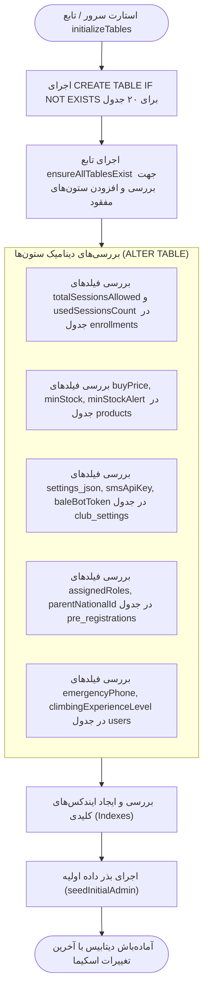

# 🔄 مکانیزم خودترمیمی و مایگریشن پایگاه داده (Self-Healing Migrations)

## ۱. فلسفه خودترمیمی اسکیما (Self-Healing Schema Philosophy)

یکی از قابلیت‌های کلیدی و پیشرفته در معماری پایگاه داده این سیستم، **موتور مایگریشن خودکار و بدون افت سرویس (Zero-Downtime Auto-Migration)** است که در فایل `/server/mysql.ts` پیاده‌سازی شده است.

برخلاف سیستم‌های سنتی که نیازمند اجرای دستی اسکریپت‌های مایگریشن در خط فرمان هستند، در این پروژه:
1. در لحظه راه‌اندازی سرور (تابع `initializeTables`) و همچنین در روت نصب دیتابیس (`/api/install/save-config`)، ساختار دیتابیس به صورت خودکار بررسی و اعتبارسنجی می‌شود.
2. چنانچه جدولی وجود نداشته باشد، با دستور `CREATE TABLE IF NOT EXISTS` ایجاد می‌گردد.
3. چنانچه ستون جدیدی در نسخه‌های ارتقایافته کد اضافه شده باشد، سیستم با اجرای کوئری‌های بررسی ساختار، ستون‌های ناموجود را شناسایی کرده و دستور `ALTER TABLE ADD COLUMN` را بدون حذف یا تخریب اطلاعات موجود اجرا می‌کند.

---

## ۲. جریان اجرای مایگریشن در `initializeTables`

---

## ۳. ایجاد کاربر مدیر اولیه (Initial Super Admin Seeding)

در فایل `/server/mysql.ts`، تابع `seedInitialAdmin` تضمین می‌کند که همواره حداقل یک حساب کاربری با نقش `super_admin` در سیستم وجود دارد:

- **بررسی وجود کاربر:** کوئری `SELECT id FROM users WHERE username = 'admin' OR nationalId = '0000000000'` اجرا می‌شود.
- **ایجاد حساب در صورت عدم وجود:**
  - **شناسه (`id`):** `admin-master-001`
  - **نام کاربری (`username`):** `admin`
  - **کد ملی (`nationalId`):** `0000000000`
  - **نام و نام خانوادگی:** `مدیر ارشد سامانه`
  - **کلمه عبور:** با استفاده از `bcrypt.hash` و ۱۰ راند سالت به صورت امن هش می‌شود (پیش‌فرض: `admin123`).
  - **نقش‌ها (`roles`):** `["super_admin", "admin", "coach", "secretary", "accountant"]`
  - **نقش فعال (`activeRole`):** `super_admin`
  - **وضعیت (`isActive`):** `1` (فعال)

---

## ۴. استراتژی ارتقای رمزهای عبور قدیمی (Legacy Password Auto-Upgrade)

سیستم به صورت خودکار به هنگام لاگین کاربران در `/server/routes/auth.routes.ts`، چنانچه کلمه عبور به فرمت هش‌شده bcrypt (شروع با `$2a$` یا `$2b$`) نباشد:
1. ابتدا رمز ورودی را با متن ساده یا هش اولیه تطبیق می‌دهد.
2. در صورت صحت، بلافاصله آن را به یک هش معتبر bcrypt تبدیل کرده و در MySQL و FileStore ذخیره می‌کند.
3. همچنین یک اندپوینت اختصاصی مدیریتی به آدرس `POST /api/users/hash-all-passwords` برای ارتقای دسته‌جمعی تمام پسوردهای قدیمی تعبیه شده است.
