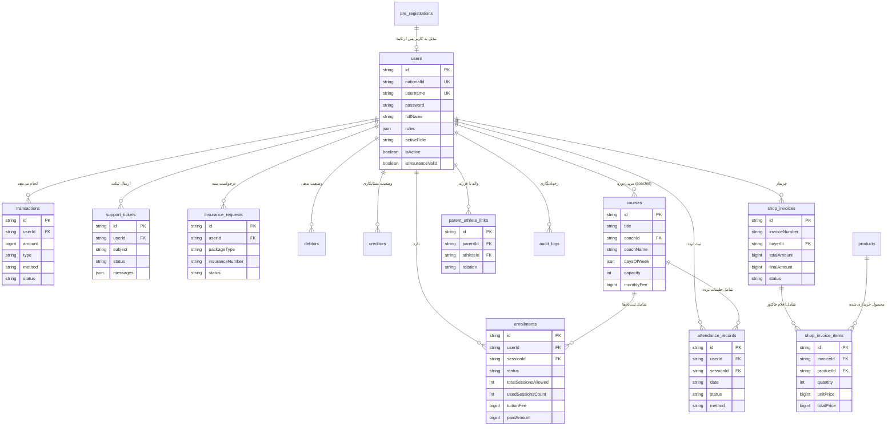

# 🔗 روابط جداول و نمودار ERD پایگاه داده (Relationships & ERD)

## ۱. نمودار جامع ارتباط موجودیت‌ها (Entity Relationship Diagram)

در طراحی پایگاه داده سامانه موج ۶۹، روابط بین موجودیت‌ها بر اساس شناسه‌های یکتا (`id` از نوع `VARCHAR(64)`) پیاده‌سازی شده‌اند. نمودار زیر روابط کلیدی بین جداول را نشان می‌دهد:

---

## ۲. مشخصات اتصالات و وابستگی‌های کلیدی

### ۲.۱. رابطه کاربر و دوره‌ها (`users` <-> `enrollments` <-> `courses`)
- **نوع رابطه:** Many-to-Many از طریق جدول میانی `enrollments`.
- **کلیدها:** فیلد `enrollments.userId` به `users.id` و فیلد `enrollments.sessionId` به `courses.id` اشاره دارد.
- **منطق کنترلی:** هر ثبت‌نام دارای فیلدهای `totalSessionsAllowed` و `usedSessionsCount` است که به ازای هر بار ثبت حضور در `attendance_records`، شمارنده `usedSessionsCount` افزایش می‌یابد.

### ۲.۲. رابطه والد و فرزند (`parent_athlete_links`)
- **نوع رابطه:** یک والد می‌تواند به چند فرزند (ورزشکار زیر ۱۸ سال) متصل باشد و بالعکس.
- **کلیدها:** `parentId` اشاره به کاربر با نقش `parent` و `athleteId` اشاره به کاربر با نقش `athlete`.

### ۲.۳. رابطه فاکتور فروشگاه و اقلام (`shop_invoices` <-> `shop_invoice_items` <-> `products`)
- **نوع رابطه:** One-to-Many بین فاکتور و ردیف‌های اقلام.
- **کلیدها:** `shop_invoice_items.invoiceId` به `shop_invoices.id` و `shop_invoice_items.productId` به `products.id`.
- **ثبت دوگانه:** برای کارایی حداکثری و جلوگیری از Joinهای سنگین در خواندن، اقلام فاکتور به صورت JSON در ستون `shop_invoices.items` نیز ذخیره می‌شوند.

### ۲.۴. تراکنش‌ها و حسابداری (`transactions`, `debtors`, `creditors`)
- هر تراکنش از طریق `userId` به کاربر مربوطه متصل است.
- نوع تراکنش (`type`) شامل مقادیر `tuition` (شهریه)، `shop` (فروشگاه)، `insurance` (بیمه)، `income` (سایر درآمدها) و `expense` (هزینه‌ها) می‌باشد.
