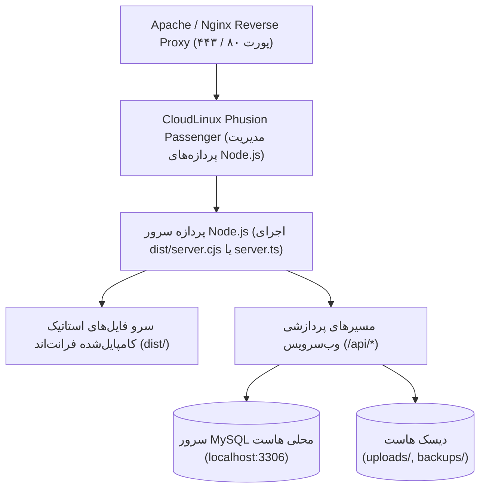

# 🚀 راهنمای استقرار در سرور و cPanel (Deployment with Passenger)

## ۱. معماری اجرا در سرورهای لینوکس (CloudLinux / cPanel)

این پروژه به گونه‌ای معماری شده است که هم در محیط‌های کانتینری مدرن (Docker / Cloud Run) و هم در هاست‌های اشتراکی سی‌پنل مجهز به **CloudLinux Phusion Passenger** با حداکثر بهره‌وری و پایداری اجرا شود.



---

## ۲. مراحل راه‌اندازی و بیلد پروژه

### گام ۱: نصب پکیج‌ها و کامپایل
```bash
# ۱. نصب تمام وابستگی‌ها
npm install

# ۲. بیلد یکپارچه کلاینت و باندل سرور
npm run build
```
دستور فوق عملیات زیر را به صورت خودکار انجام می‌دهد:
- بیلد فرانت‌اند با Vite و خروجی در پوشه `dist/`
- کامپایل فایل `server.ts` به یک باندل واحد بهینه‌شده در `dist/server.cjs` با `esbuild`

### گام ۲: تنظیمات Setup Node.js App در cPanel
1. در پنل cPanel وارد بخش **Setup Node.js App** شوید.
2. بر روی دکمه **Create Application** کلیک کنید:
   - **Node.js Version:** نسخه `18.x` یا `20.x` یا `22.x` را انتخاب نمایید.
   - **Application Mode:** گزینه `Production`
   - **Application Root:** مسیر پوشه ریشه پروژه (مانند `moj69`)
   - **Application URL:** دامنه یا ساب‌دامنه مورد نظر
   - **Application Startup File:** مقدار `dist/server.cjs` (یا `server.ts` در صورت استفاده از tsx)

---

## ۳. پیکربندی فایل `.htaccess`

فایل `.htaccess` در ریشه پروژه قرار دارد و ترافیک وب را به پردازه Passenger هدایت می‌کند:

```apache
PassengerAppRoot "/home/username/moj69"
PassengerAppType node
PassengerStartupFile dist/server.cjs
PassengerNodejs "/home/username/nodevenv/moj69/20/bin/node"

RewriteEngine On
RewriteRule ^uploads/(.*)$ uploads/$1 [L]
RewriteCond %{REQUEST_FILENAME} !-f
RewriteRule ^(.*)$ http://127.0.0.1:3000/$1 [P,L]
```

---

## ۴. پیکربندی متغیرهای محیطی و فایل‌های پایگاه داده

اطلاعات اتصال به دیتابیس MySQL را می‌توانید در فایل `.env` یا فایل `config.json` در ریشه پروژه قرار دهید:

```env
# .env
DB_HOST=localhost
DB_PORT=3306
DB_USER=moj_db_user
DB_PASSWORD=SecurePassword_123!
DB_NAME=moj_climbing_db
JWT_SECRET=super_secret_jwt_key_wave69_secure_2026
PORT=3000
NODE_ENV=production
```
یا از طریق روت هوشمند نصب (`/api/install/save-config`) بدون نیاز به دستکاری دستی فایل، مشخصات را از طریق رابط کاربری ذخیره نمایید.
