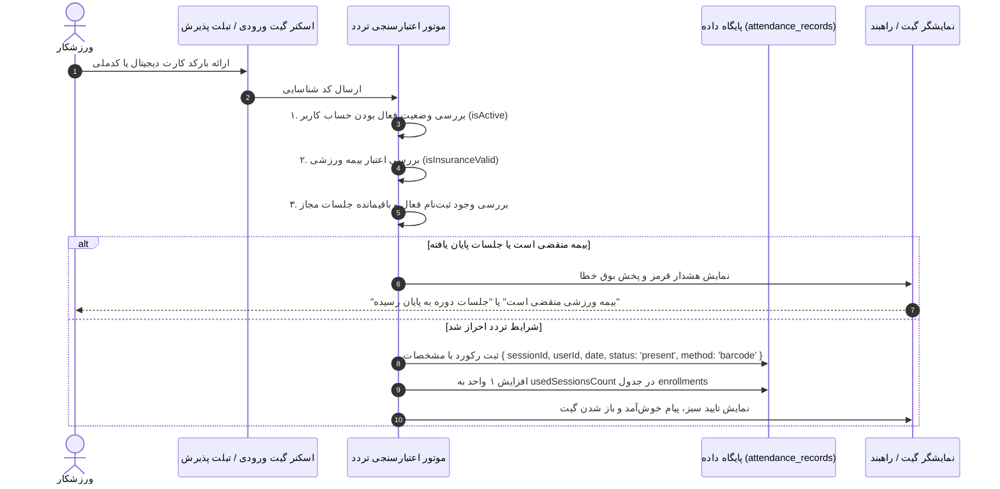

# 🎫 ماژول حضور و غیاب و کارت عضویت دیجیتال (Attendance & Digital Card)

## ۱. کارت عضویت هوشمند دیجیتال (`DigitalMembershipCardModal.tsx`)

سامانه مجهز به یک سیستم پیشرفته صدور کارت عضویت دیجیتال و گیت تردد است که تمامی جزئیات فنی آن در فایل `/src/components/DigitalMembershipCardModal.tsx` پیاده‌سازی شده است.

```mermaid
flowchart LR
    subgraph CardFront["روی کارت (Front of Card)"]
        F1["لوگوی باشگاه موج ۶۹ + نشان Smart Digital Member"]
        F2["شماره عضویت اختصاصی (W69-XXXXXX)"]
        F3["تصویر پرسنلی ورزشکار با نشان وضعیت فعال/غیرفعال"]
        F4["نام و نام خانوادگی، کدملی و تلفن همراه"]
        F5["نشانگر وضعیت بیمه ورزشی (سبز: معتبر / قرمز: فاقد بیمه)"]
        F6["عنوان دوره آموزشی فعال"]
        F7["بارکد نوری خطی (Code128 Deterministic Barcode)"]
        F8["کد QR هوشمند رمزنگاری‌شده گیت تردد"]
    end

    subgraph CardBack["پشت کارت (Back of Card)"]
        B1["قوانین و مقررات سالن سنگ‌نوردی"]
        B2["الزام ثبت ورود/خروج در گیت الکترونیکی"]
        B3["تلفن‌های تماس اضطراری و آدرس مجموعه"]
        B4["کد QR بزرگ جهت اسکن با اسکنرهای دیواری"]
        B5["پروتکل امنیتی تایید هویت Wave69"]
    end

    CardFront <-->|دکمه چرخش سه‌بعدی کارت 3D Flip| CardBack
```



---

## ۲. مشخصات بارکد و QR Code گیت تردد

### ۲.۱. مولد بارکد خطی (`SvgBarcode`)
- از یک الگوریتم الگوی قطعی مبتنی بر کاراکترهای کدملی (`nationalId`) برای رسم خطوط سیاه و سفید استاندارد SVG استفاده می‌کند.
- بدون نیاز به لود فونت‌های متفرقه بارکد، توسط اسکنرهای بارکدخوان نوری USB و لیزری گیت ورودی با سرعت بالا اسکن می‌شود.

### ۲.۲. کد QR هوشمند (`SvgQrCode`)
- یک ماتریس استاندارد 21x21 است که اطلاعات ورزشکار را در قالب یک رشته JSON به همراه پروتکل اعتبارسنجی بسته‌بندی می‌کند:
  ```json
  {
    "club": "Wave69",
    "memberId": "usr-102938",
    "name": "علی رضایی",
    "natId": "0012345678",
    "phone": "09121234567",
    "cardNo": "W69-345678",
    "insurance": "VALID",
    "course": "بولدرینگ پیشرفته"
  }
  ```

---

## ۳. فرآیند ثبت تردد و اعتبارسنجی گیت (`Attendance Tracker`)

هنگام اسکن بارکد یا کد QR در گیت ورودی باشگاه (`AttendanceTrackerView`):



### روش‌های ثبت تردد (`method`):
- `barcode`: اسکن نوری بارکد کارت دیجیتال
- `qrcode`: اسکن دوربین کد QR
- `manual`: ثبت دستی توسط مربی یا منشی پذیرش
- `fingerprint`: ثبت از طریق دستگاه‌های بیومتریک سازگار
