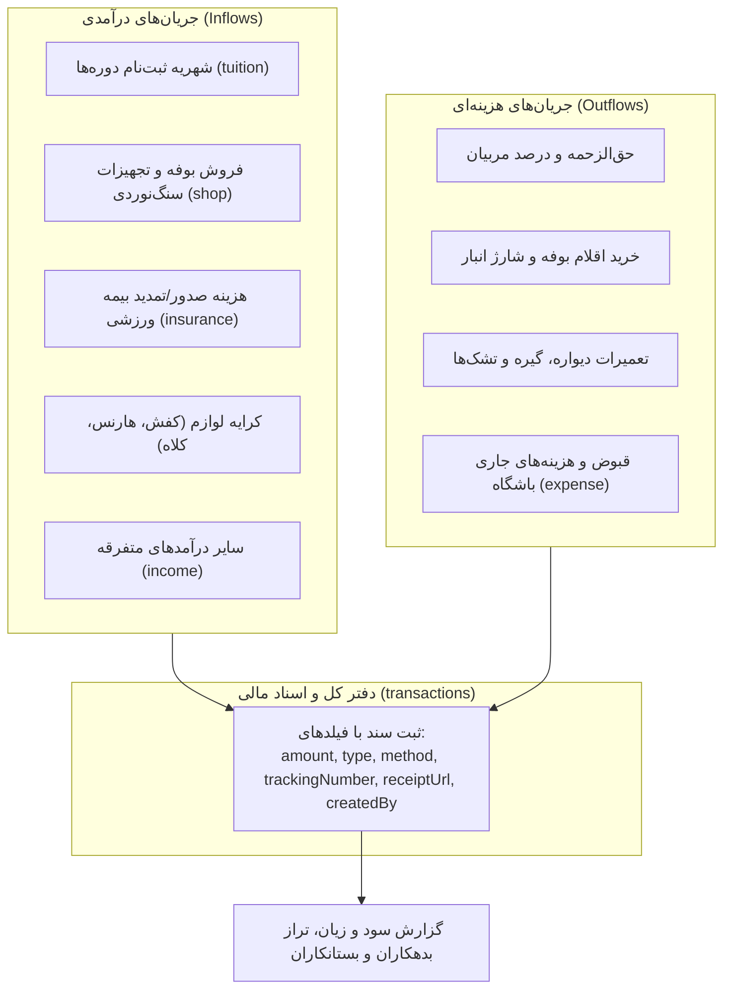
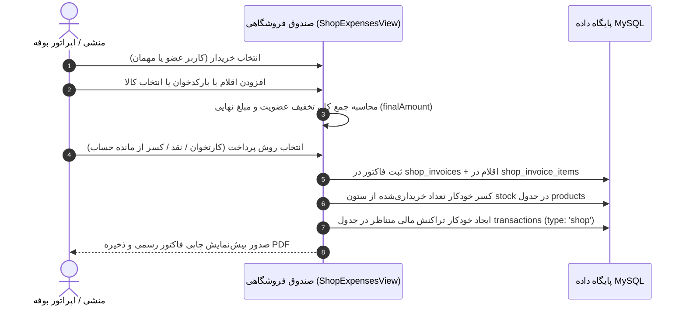

# 💰 ماژول مالی، حسابداری و فروشگاه (Finance & Shop Module)

## ۱. ساختار حسابداری و ثبت تراکنش‌ها (`transactions`)

سامانه دارای سیستم دوبل حسابداری سبک ورزشی است که تمامی گردش‌های نقدی و غیرنقدی را ثبت می‌کند:

### روش‌های پرداخت (`method`):
- `cash`: وجه نقد
- `pos`: دستگاه کارتخوان پذیرش
- `card_to_card`: کارت‌به‌کارت بانکی (همراه با پیوست تصویر فیش `receiptUrl` و شماره پیگیری `trackingNumber`)
- `wallet`: کیف پول دیجیتال اعضا

---

## ۲. سیستم مدیریت فروشگاه و بوفه (`products` & `shop_invoices`)

### ۲.۱. ساختار کالاها و انبارداری (`products`)
- **قیمت‌گذاری دوگانه:** ثبت قیمت خرید (`buyPrice`) و قیمت فروش (`price`) جهت محاسبه دقیق سود خالص هر فاکتور.
- **کنترل موجودی و نقطه سفارش:** فیلد `stock` موجودی لحظه‌ای را نگه‌داری می‌کند و با رسیدن به `minStockAlert`، آیکون هشدار کسری کالا در پنل مدیریت روشن می‌شود.

### ۲.۲. فرآیند صدور فاکتور رسمی بوفه (`shop_invoices`)

