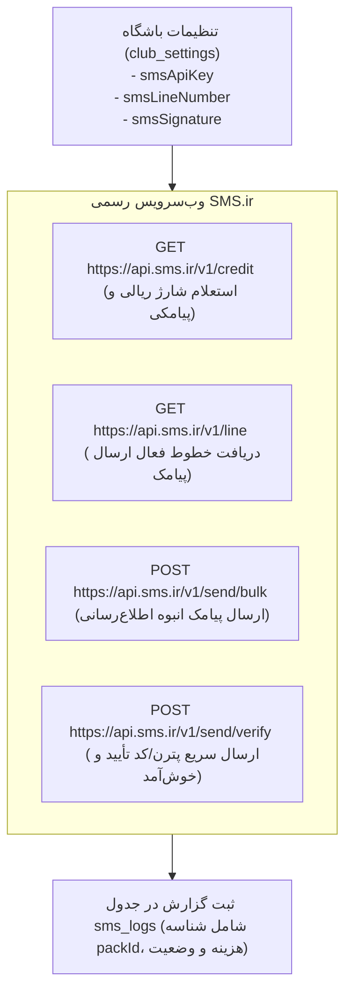

# 📨 ماژول پیام‌رسانی، اعلان‌ها و پشتیبانی (Messaging & Notifications)

## ۱. وب‌سرویس پیامک پیام‌کوتاه (SMS.ir Integration)

سیستم ارتباط پیامکی در فایل `/server/routes/messaging.routes.ts` پیاده‌سازی شده و مستقیماً به نسخه جدید API سامانه **SMS.ir (v1)** متصل است:

---

## ۲. یکپارچه‌سازی با ربات پیام‌رسان بله (Bale Messenger Bot)

برای ارسال پیام‌ها و اطلاعیه‌های باشگاه به کانال یا گروه‌های اختصاصی اعضا در پیام‌رسان ملی **بله**:
- **آدرس پایه API:** `https://tapi.bale.ai/bot<TOKEN>/`
- **اندپوینت‌ها:**
  - `POST /api/bale/test-connection`: فراخوانی متد `getMe` بله جهت اطمینان از سلامت توکن و نام ربات.
  - `POST /api/bale/send-message`: ارسال پیام به `chat_id` کانال با متد `sendMessage`.

---

## ۳. اعلان‌های درون‌برنامه‌ای و زنگوله (`app_notifications`)

سامانه دارای سیستم ارسال نوتیفیکیشن هوشمند است:
- **مخاطبین هدف (`targetAudience`):** `all` (همه)، `admin` (مدیران)، `coach` (مربیان)، `athlete` (ورزشکاران)، `parent` (والدین).
- **فیلتر امنیتی محتوا:** در اندپوینت `GET /api/club/notifications`، اعلان‌های سیستمی حساس (مانند فیش‌های واریزی بررسی‌نشده یا رخدادهای پیش‌ثبت‌نام) از دید ورزشکاران عادی فیلتر می‌شوند تا فقط مدیران آن‌ها را مشاهده کنند.
- **وضعیت خوانده‌شده:** تغییر وضعیت `isRead` به `1` با فراخوانی `PUT /api/club/notifications/:id/read`.

---

## ۴. سامانه تیکتینگ و گفت‌وگو (`support_tickets`)

ورزشکاران و مربیان می‌توانند در پنل کاربری خود برای مدیریت باشگاه تیکت ثبت کنند:
- هر تیکت دارای فیلدهای `subject`, `category`, `priority`, `status` و آرایه‌ای از پیام‌های ردوبدل‌شده در ستون `messages` به صورت JSON است.
- دو پرچم `hasUnreadAdminMessage` و `hasUnreadUserMessage` به صورت خودکار با ارسال هر پاسخ به‌روزرسانی می‌شوند تا پیام‌های جدید در هدر و زنگوله برجسته شوند.
