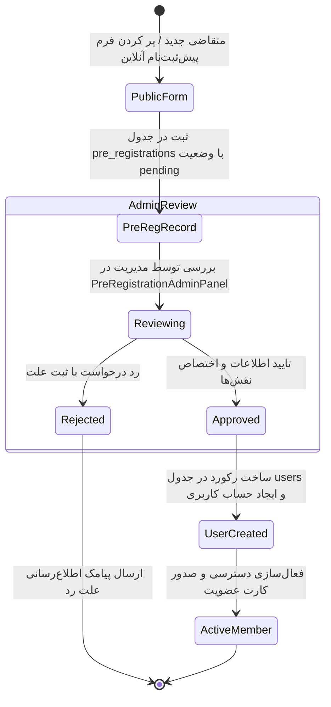

# 👥 ماژول مدیریت اعضا، نقش‌ها و پیش‌ثبت‌نام (Users & Roles Module)

## ۱. چرخه حیات و ثبت‌نام اعضا

سامانه موج ۶۹ از دو جریان اصلی برای ورود کاربران به سیستم پشتیبانی می‌کند:

---

## ۲. مشخصات پرونده عضو و پروفایل ۳۶۰ درجه (`Member360Modal`)

در کامپوننت `Member360Modal`، پرونده جامع ورزشکار شامل بخش‌های زیر است:
1. **اطلاعات هویتی و پرسنلی:** کدملی، شماره شناسنامه، تاریخ تولد، نام پدر، عکس پرسنلی، سایز کفش سنگ‌نوردی و پوشاک.
2. **اطلاعات پزشکی و اضطراری:** وضعیت بیمه ورزشی فدراسیون پزشکی ورزشی، تاریخ انقضای بیمه، گروه خونی، بیماری‌ها و آسیب‌های قبلی، نام و شماره تماس اضطراری.
3. **سوابق ورزشی و دوره‌ها:** لیست دوره‌های فعال و منقضی‌شده، تعداد جلسات باقیمانده، روزهای تمرین و مربی مربوطه.
4. **پرونده مالی:** تاریخچه تراکنش‌ها، بدهی‌ها، تخفیف‌ها و فاکتورهای صادرشده بوفه/فروشگاه.
5. **سوابق تردد و حضور و غیاب:** نمودار تردد ماهانه و سوابق تاخیر یا غیبت در سانس‌ها.

---

## ۳. پیوند والد و فرزند (`Parent-Athlete Linkage`)

برای ورزشکاران خردسال و نوجوان (زیر ۱۸ سال):
- فیلد `isUnder18` فعال شده و مشخصات والد (نام، کدملی و تلفن همراه والد) دریافت می‌شود.
- در جدول `parent_athlete_links` رابطه بین حساب والد (نقش `parent`) و فرزند (نقش `athlete`) ثبت می‌گردد.
- والد با لاگین در پرتال خود می‌تواند وضعیت حضور، باقیمانده جلسات، وضعیت بیمه ورزشی و پرداخت شهریه فرزند را مشاهده و مدیریت نماید.
