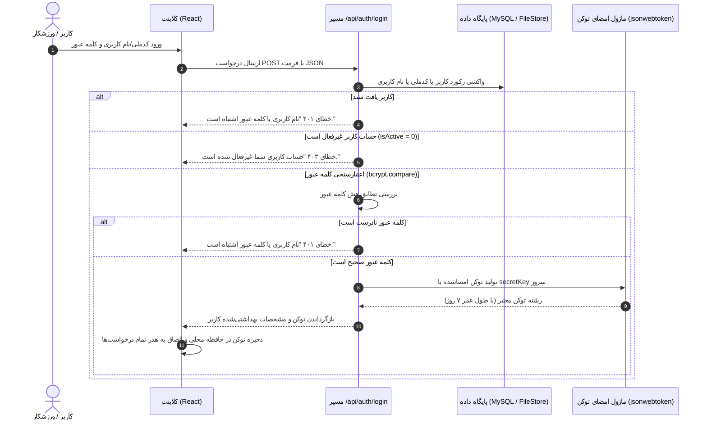

# 🔐 احراز هویت و کنترل دسترسی‌ها (Authentication & RBAC)

## ۱. مکانیسم احراز هویت مبتنی بر توکن (JWT Flow)

سامانه از استاندارد **JSON Web Token (JWT)** به صورت بدون حالت (Stateless) برای احراز هویت استفاده می‌کند:

---

## ۲. کنترل دسترسی مبتنی بر نقش (Role-Based Access Control - RBAC)

سامانه از یک ساختار چندنقشی (Multi-Role) پشتیبانی می‌کند. هر کاربر می‌تواند چندین نقش داشته باشد (`roles: string[]`) و در هر لحظه یک نقش فعال (`activeRole`) داشته باشد.

| نقش سیستم | نام فارسی | حوزه دسترسی و مسئولیت‌ها |
| :--- | :--- | :--- |
| `super_admin` | مدیر ارشد سیستم | دسترسی تام به تمامی بخش‌ها، تنظیمات دیتابیس، بک‌آپ‌ها و مدیریت نقش‌ها |
| `admin` | مدیر باشگاه | مدیریت اعضا، دوره‌ها، امور مالی، فروشگاه، پیامک‌ها و گزارش‌ها |
| `secretary` | منشی / پذیرش | ثبت‌نام، ثبت تردد و حضورغیاب، صدور فاکتور فروشگاه و پذیرش مراجعین |
| `accountant` | حسابدار | مدیریت تراکنش‌ها، بدهکاران، بستانکاران، بستن حساب‌ها و گزارش‌های مالی |
| `coach` | مربی رسمی | مشاهده سانس‌های اختصاصی، ثبت حضور و غیاب ورزشکاران و پرتال مربی |
| `athlete` | ورزشکار / عضو | مشاهده دوره‌های ثبت‌نامی، کارت عضویت دیجیتال، سوابق تردد و تیکتینگ |
| `parent` | والد / سرپرست | نظارت بر فرزندان ورزشکار زیر ۱۸ سال، مشاهده سوابق مالی و تمدید بیمه |

---

## ۳. امنیت کلمات عبور و ارتقای خودکار به Bcrypt

- تمامی رمزهای عبور ورودی جدید با استفاده از الگوریتم **Bcrypt** و `saltRounds = 10` رمزنگاری می‌شوند.
- در تابع لاگین (`/server/routes/auth.routes.ts`)، چنانچه رمز عبور کاربر با `$2a$` یا `$2b$` شروع نشده باشد (حساب‌های ایجادشده در نسخه‌های آزمایشی قبلی)، پس از تایید صحت، رمز به صورت خودکار به هش امن تبدیل شده و در دیتابیس جایگزین می‌گردد.

---

## ۴. مقابله با آسیب‌پذیری ارجاع مستقیم و ناامن به اشیاء (IDOR Protection)

در اندپوینت‌های حساس نظیر دریافت پروفایل (`GET /api/users/:id`)، ویرایش کاربر (`PUT /api/users/:id`) و مشاهده تیکت‌ها (`GET /api/club/tickets`):
- چنانچه کاربر از کادر مدیریتی نباشد، سیستم کنترل می‌کند که شناسه موجود در پارامتر مسیر (`req.params.id`) دقیقاً با شناسه کاربر لاگین‌شده (`req.user.id`) یکسان باشد.
- در صورت عدم تطابق، سیستم با خطای `403 Forbidden` مانع از نشت اطلاعات یا دستکاری پروفایل سایر اعضا می‌شود.
- در عملیات ویرایش توسط خود کاربر، فیلدهای حساسی نظیر `roles`, `activeRole`, `debtAmount` و `discountPercent` به صورت خودکار حذف شده تا امکان ارتقای سطح دسترسی (Privilege Escalation) وجود نداشته باشد.
