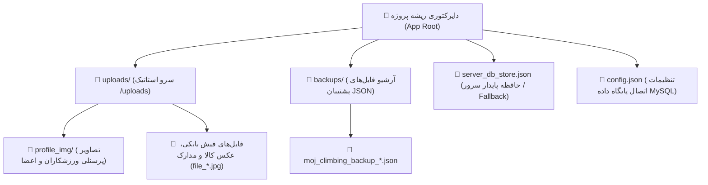

# 📁 سیستم ذخیره‌سازی فایل‌ها و رسانه (File & Storage System)

## ۱. ساختار پوشه‌بندی و فایل‌های دیسک

سامانه موج ۶۹ از سیستم فایل محلی سرور برای نگه‌داری دائمی رسانه‌ها و نسخه‌های پشتیبان استفاده می‌کند:



---

## ۲. جریان پردازش آپلود دوگانه (Multipart & Base64 Converter)

سامانه از دو روش استاندارد برای دریافت فایل‌ها پشتیبانی می‌کند:

```mermaid
flowchart TD
    subgraph MultipartUpload["روش ۱: آپلود چندبخشی (Multer)"]
        M1["درخواست POST /api/upload (multipart/form-data)"] --> M2["بررسی سقف ۵ مگابایت (MAX_FILE_SIZE_BYTES)"]
        M2 --> M3["بررسی MIME Type ارسالی"]
        M3 --> M4["ذخیره موقت در دیسک"]
        M4 --> M5["اعتبارسنجی Magic Bytes"]
        M5 -- "نامعتبر" --> M_Err["حذف فایل از دیسک و خطای ۴۰۰"]
        M5 -- "معتبر" --> M_Ok["تولید آدرس نسبی /uploads/file_xxx.ext"]
    end

    subgraph Base64Upload["روش ۲: تبدیل مستقیم Base64 به فایل"]
        B1["درخواست POST /api/upload/base64 یا داده در همگام‌سازی"] --> B2["تابع convertBase64ToLocalFile"]
        B2 --> B3["استخراج بافر باینری از data:image/...;base64,..."]
        B3 --> B4["بررسی حجم و Magic Bytes"]
        B4 -- "معتبر" --> B5["ذخیره با نام یکتا در /uploads/ یا /uploads/profile_img/"]
        B5 --> B6["بازگرداندن URL محلی و جایگزینی در فیلدهای دیتابیس"]
    end
```



---

## ۳. سیستم پشتیبان‌گیری کامل (`/backups/`)

در روت‌های `/api/backup/*`، مدیران می‌توانند از کل پایگاه داده فایل JSON استخراج کنند:
- **نام‌گذاری استاندارد:** `moj_climbing_backup_[tag]_[timestamp].json`
- **ساختار داده بک‌آپ:**
  ```json
  {
    "backupDate": "2026-08-23T00:00:00.000Z",
    "backupTag": "manual_before_upgrade",
    "version": "2.0.0",
    "data": {
      "roles": [ ... ],
      "users": [ ... ],
      "courses": [ ... ],
      "enrollments": [ ... ],
      "transactions": [ ... ],
      "products": [ ... ],
      ...
    }
  }
  ```
- **بازیابی اتمیک (Atomic Restore):** فرآیند بازیابی تمام داده‌ها را داخل یک تراکنش واحد (`withTransaction`) با غیرفعال‌سازی موقت کلیدهای خارجی (`SET FOREIGN_KEY_CHECKS=0`) اجرا می‌کند تا هیچ‌گونه خطای تداخل وابستگی رخ ندهد.
