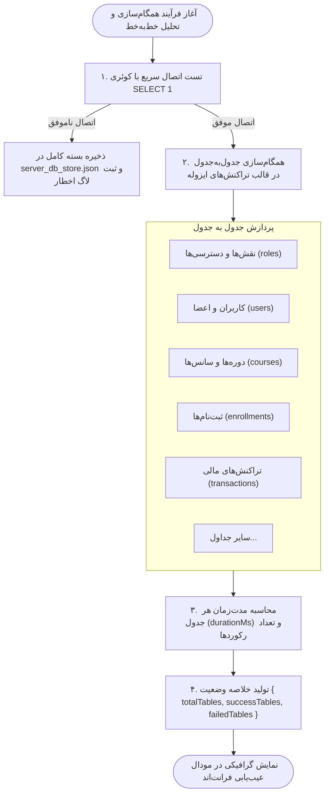

# 🩺 عیب‌یابی، سلامت‌سنجی و همگام‌سازی (Diagnostics & Troubleshooting)

## ۱. ابزار عیب‌یابی خط‌به‌خط همگام‌سازی (`SyncDiagnosticsModal`)

در فایل `/server/routes/sync.routes.ts`، اندپوینت `POST /api/mysql/sync-detailed` طراحی شده است تا مدیران ارشد بتوانند فرآیند همگام‌سازی ۱۹ جدول دیتابیس را به صورت زنده و با جزئیات میلی‌ثانیه‌ای رصد کنند:

---

## ۲. مانیتورینگ آنلاین جداول پایگاه داده (`MySqlTablesTestModal`)

از طریق اندپوینت `GET /api/mysql/test-tables`:
- نام تمامی ۲۰ جدول به همراه نام فارسی معادل آن‌ها بررسی می‌شود.
- کوئری `SELECT COUNT(*) FROM [table]` به صورت زنده اجرا شده و تعداد رکوردهای موجود گزارش می‌گردد.
- در صورت عدم وجود یک جدول یا خطای سطح دسترسی، وضعیت مشخص به کاربر اعلام می‌شود.

---

## ۳. راهنمای رفع خطاهای متداول

### خطای ۱: `ECONNREFUSED` یا عدم امکان اتصال به MySQL
- **علت:** سرویس دیتابیس MySQL خاموش است یا پورت ۳۳۰۶ مسدود شده است.
- **راهکار:**
  1. وضعیت سرویس MySQL در هاست را بررسی کنید (`systemctl status mysql` یا از طریق cPanel).
  2. بررسی کنید اطلاعات فایل `config.json` با نام کاربری و رمز دیتابیس همخوانی داشته باشد.
  3. دقت نمایید سامانه در زمان قطعی دیتابیس، به طور خودکار داده‌ها را در `server_db_store.json` نگه‌داری می‌کند تا هیچ داده‌ای مفقود نشود.

### خطای ۲: `ER_ACCESS_DENIED_ERROR`
- **علت:** نام کاربری یا کلمه عبور دیتابیس در MySQL اشتباه است یا کاربر دسترسی به دیتابیس مربوطه (Privileges) را ندارد.
- **راهکار:** در cPanel وارد بخش **MySQL Databases** شده و اطمینان حاصل کنید دکمه **Add User to Database** را فشرده و تیک **ALL PRIVILEGES** را زده باشید.

### خطای ۳: خطای حجم بیش از حد در آپلود فایل (`File size exceeds limit`)
- **علت:** تلاش برای آپلود فایل بیش از ۵ مگابایت.
- **راهکار:** حجم مجاز آپلود در میدل‌ور `MAX_FILE_SIZE_BYTES` برابر ۵ مگابایت است. فایل ارسالی یا تصاویر فیش باید فشرده‌سازی شوند.
